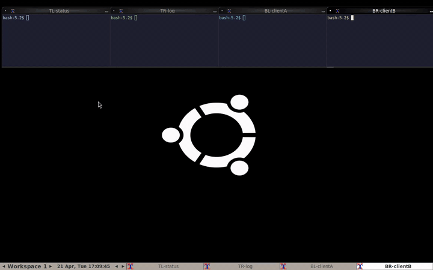
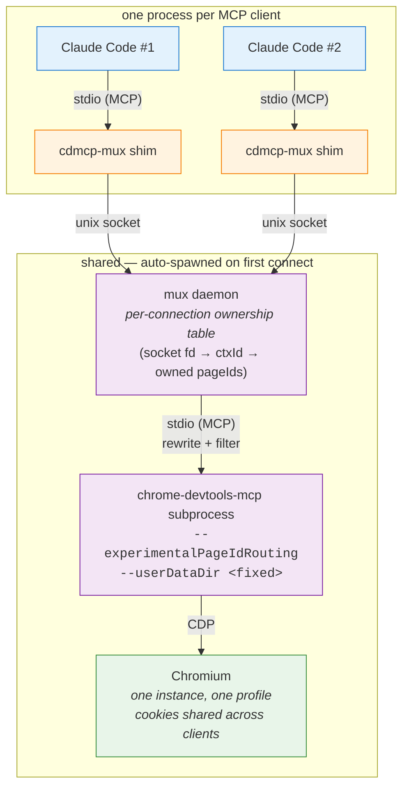

# chrome-devtools-mcp-mux

[](https://github.com/ochen1/chrome-devtools-mcp-mux/actions/workflows/ci.yml)

**Drop-in replacement for `chrome-devtools-mcp`** that lets many MCP clients share one Chrome instance and one profile without stepping on each other's tabs. Each client — a separate
Claude Code session, for example — gets its own isolated set of tabs, while
they all run against the same single browser and profile.

<p align="center">
  
</p>

<p align="center"><em>Idle waits auto-compressed to 0.5 s each. Full-resolution mp4s in <a href="demo/artifacts/">demo/artifacts/</a>: <a href="demo/artifacts/mux-demo-condensed.mp4">condensed (9 s)</a> · <a href="demo/artifacts/mux-demo.mp4">full 2:26</a>. Reproducer in <a href="demo/">demo/</a>.</em></p>

## What problem does this solve

`chrome-devtools-mcp` exposes Chrome DevTools to an MCP client. It works
perfectly for one client, but if two clients connect at once (two Claude Code
windows, a Claude Code plus a Gemini CLI, a coding agent plus a test runner —
anything using the same config) they step on each other's tabs: `list_pages`
shows everything, `select_page` races, `new_page` lands in the wrong window,
`close_page` can shut down another client's work.

`cdmcp-mux` sits between the clients and `chrome-devtools-mcp` and tracks who
owns which tab. Each client sees only its own tabs; cross-client collisions
are rejected before they ever reach the browser.

## vs. vanilla `chrome-devtools-mcp`

| Concern | `chrome-devtools-mcp` | `chrome-devtools-mcp-mux` |
|---|---|---|
| Config shape | `npx -y chrome-devtools-mcp@latest` | `npx -y chrome-devtools-mcp-mux@latest` — literally one token different |
| Tools exposed to clients | full vanilla surface | **identical** (pageId stays stripped; `isolatedContext` still exposed as opt-in) |
| Chrome profile / cookies / logins / extensions | one `--userDataDir` | **same** `--userDataDir`, no forced incognito |
| Single client running alone | fine | fine — no behavior change, no overhead worth worrying about |
| Two+ clients against one Chrome | **collide**: shared `list_pages`, racy `select_page`, cross-client `close_page` | **isolated at the tool layer**: `list_pages` per-client, cross-client tool calls rejected |
| `new_page`'s optional `isolatedContext` | passes through | passes through (you can still opt in to per-tab isolation if you want it) |
| CLI flag pass-through (`--viewport`, `--browserUrl`, etc.) | ✓ | ✗ not yet — see [drop-in gaps](#drop-in-gaps) |
| `--autoConnect` / attaching to a running Chrome | ✓ | ✗ not yet |
| Upstream version | latest every `npx` | pins a tested `chrome-devtools-mcp` version per release |
| Maintained by | Chrome DevTools team | this repo (thin wrapper over upstream) |
| Runtime overhead | zero | one long-lived daemon process, one unix socket hop per tool call |

**Rule of thumb:** if you only ever run one MCP client at a time, stick with
vanilla. If you run two or more — different Claude Code sessions, an agent
plus your own debugger, parallel test runners, etc. — the mux stops them from
corrupting each other's state.

### Drop-in gaps

A small number of vanilla behaviors aren't plumbed through the mux yet. Open
an issue if one matters to you:

- **Arbitrary CLI args passed in `"args"`** (e.g. `--viewport=1920x1080`) are
  currently ignored. The mux spawns upstream with a fixed set of flags.
- **`--browserUrl`, `--wsEndpoint`, `--autoConnect`** — the mux always launches
  its own Chromium; it doesn't yet know how to attach to one that's already
  running.
- **Upstream version** is pinned per release. If upstream ships a new tool,
  the mux needs a version bump to expose it.

For anything not on this list, the mux is behaviorally indistinguishable from
vanilla for a single client, and strictly better for many.

## Install and configure

If your `.mcp.json` currently looks like this (the canonical upstream setup):

```jsonc
{
  "mcpServers": {
    "chrome-devtools": {
      "command": "npx",
      "args": ["-y", "chrome-devtools-mcp@latest"]
    }
  }
}
```

change `chrome-devtools-mcp@latest` to `chrome-devtools-mcp-mux@latest` and
you're done:

```jsonc
{
  "mcpServers": {
    "chrome-devtools": {
      "command": "npx",
      "args": ["-y", "chrome-devtools-mcp-mux@latest"]
    }
  }
}
```

The first client to connect auto-spawns a shared daemon; subsequent clients
attach to the same daemon. Each gets its own view of tabs, but they all live
in the same Chrome profile — so your cookies, logins, and extensions are the
same as with vanilla `chrome-devtools-mcp`.

<details>
<summary>Local-dev install (building from source)</summary>

```bash
git clone https://github.com/ochen1/chrome-devtools-mcp-mux
cd chrome-devtools-mcp-mux
npm install
npm run build
npm link           # exposes `cdmcp-mux` on PATH
```

Then `"command": "cdmcp-mux"` in `.mcp.json`.
</details>

## How to verify it's working

Start two MCP clients with the config above. In each, ask the model to:

1. Open a different URL via `new_page`.
2. Run `list_pages`.

Each client should see only its own page. On the host, run `cdmcp-mux status`
to see both contexts side-by-side in the daemon.

For a full scripted demo with a recorded video, see [`demo/`](demo/).

## Environment variables (optional)

| Variable                     | Purpose                                            |
|------------------------------|----------------------------------------------------|
| `CDMCP_MUX_CHROMIUM`         | Chromium binary (defaults to bundled Puppeteer)    |
| `CDMCP_MUX_USER_DATA_DIR`    | Override Chrome profile directory                  |
| `CDMCP_MUX_SOCKET`           | Override unix socket path for the daemon           |
| `CDMCP_MUX_HEADLESS`         | `false` makes Chrome visible (default: headless)   |
| `MCP_MUX_DEBUG`              | `1` logs every rewrite diff                        |

## Debugging

All out-of-band; the mux never exposes debug tools to MCP clients.

| Command                  | What it does                                       |
|--------------------------|----------------------------------------------------|
| `cdmcp-mux status`       | daemon pid, upstream state, contexts, owned pages  |
| `cdmcp-mux tail [-f]`    | stream the structured mux log                      |

The log lives at `~/.local/state/cdmcp-mux/mux.log`.

## How it works



Each MCP client spawns its own `cdmcp-mux` shim (that's how `.mcp.json` works —
one child per client). The shim is a pure byte pipe between the client's stdio
and a unix socket; the first shim to connect auto-spawns the shared daemon,
later shims attach to it. The daemon owns **one** `chrome-devtools-mcp`
subprocess driving **one** Chromium with **one** `--userDataDir`.

The daemon advertises the same tool schemas as vanilla `chrome-devtools-mcp`.
Every connection gets its own *ownership table* of pageIds it created; the
daemon filters `list_pages` to that set and rejects cross-context calls to
`close_page`, `select_page`, and other page-scoped tools. `pageId` is stripped
from the advertised schemas and re-injected internally on every `tools/call`,
so concurrent calls from different clients always target the right tab —
backed by upstream's `--experimentalPageIdRouting`.

Tabs are **not** forced into isolated browser contexts — all clients share the
same Chrome profile, so your cookies and logins work the same as with vanilla
`chrome-devtools-mcp`. The `isolatedContext` parameter on `new_page` stays
exposed exactly like upstream: if a client *wants* an incognito-style context,
it passes it, and the mux forwards it verbatim. When a client disconnects, the
daemon closes every tab it owned and the rest keep running.

## Development notes

This project was written end-to-end by a Claude-Code agent in a single
working session, driven by live conversational requirements. The full test
plan is tiered for functional correctness (58 tests, ~19 s, all passing),
and the multiplexer was then visually demonstrated via a VNC-automated
reproducer.

For the PRD-to-test mapping see [`DEMO.md`](DEMO.md). For the full agentic
development log — requirements discovery, architecture iteration, test
tiering, and the three takes of the video demo — see
[`demo/README.md`](demo/README.md).

## Testing

```bash
# requires a Chromium binary; the smoke/e2e tests need it
CDMCP_MUX_CHROMIUM=/usr/bin/chromium npm test
```

Expected: `8 files, 58 tests, all passing`.

## Releasing

CI runs on every push and PR against `main` using Node 22 and 24, building,
typechecking, and executing the full 58-test suite (including the real-Chromium
smoke and binary-e2e tests).

Publishing is automated via `.github/workflows/publish.yml`, which runs on a
GitHub release being published:

1. Bump `version` in `package.json`, commit, tag as `v<version>`.
2. `gh release create v<version> --generate-notes`.
3. The workflow builds, tests, and runs `npm publish` with
   [npm provenance](https://docs.npmjs.com/generating-provenance-statements)
   (signed via GitHub OIDC, the workflow has `id-token: write`).

`NPM_TOKEN` is the only required repo secret. The package is published with
`publishConfig.provenance: true`, so the `--provenance` flag is implicit.
Once this repo is registered as a **trusted publisher** at npmjs.com, the
`NPM_TOKEN` secret can be removed entirely.

## License

Apache-2.0 — see [`LICENSE`](LICENSE). Same as upstream `chrome-devtools-mcp`.
