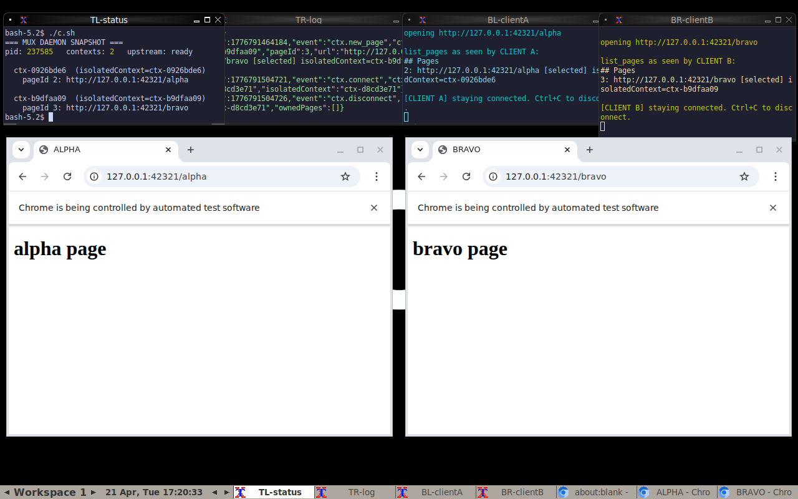

# chrome-devtools-mcp-mux

Share one Chrome instance across many MCP clients. Each client — a separate
Claude Code session, for example — gets its own isolated set of tabs, while
they all run against the same single browser and profile.



## What problem does this solve

`chrome-devtools-mcp` exposes Chrome DevTools to an MCP client. It works
perfectly for one client, but if two clients connect at once (two Claude Code
windows, a Claude Code plus a Gemini CLI, etc.) they step on each other's
tabs — `list_pages` shows everything, `select_page` races, `new_page` lands
in the wrong window.

`cdmcp-mux` sits between clients and `chrome-devtools-mcp` and gives each
connection its own isolated tab set, while keeping a single Chrome running.

## Install and configure (one-time)

```bash
git clone <this-repo> chrome-devtools-mcp-mux
cd chrome-devtools-mcp-mux
npm install
npm run build
npm link           # exposes `cdmcp-mux` on PATH
```

Then, in every MCP client's `.mcp.json`:

```jsonc
{
  "mcpServers": {
    "chrome": { "command": "cdmcp-mux" }
  }
}
```

That's it. The first client to connect auto-spawns a shared daemon; subsequent
clients attach to the same daemon.

## How to verify it's working

Start two MCP clients with the config above. In each, ask the model to:

1. Open a different URL via `new_page`.
2. Run `list_pages`.

Each client should see only its own page. On the host, run `cdmcp-mux status`
to see both contexts side-by-side in the daemon.

For a full scripted demo with a recorded video, see [`demo/`](demo/).

## Environment variables (optional)

| Variable                     | Purpose                                            |
|------------------------------|----------------------------------------------------|
| `CDMCP_MUX_CHROMIUM`         | Chromium binary (defaults to bundled Puppeteer)    |
| `CDMCP_MUX_USER_DATA_DIR`    | Override Chrome profile directory                  |
| `CDMCP_MUX_SOCKET`           | Override unix socket path for the daemon           |
| `CDMCP_MUX_HEADLESS`         | `false` makes Chrome visible (default: headless)   |
| `MCP_MUX_DEBUG`              | `1` logs every rewrite diff                        |

## Debugging

All out-of-band; the mux never exposes debug tools to MCP clients.

| Command                  | What it does                                       |
|--------------------------|----------------------------------------------------|
| `cdmcp-mux status`       | daemon pid, upstream state, contexts, owned pages  |
| `cdmcp-mux tail [-f]`    | stream the structured mux log                      |

The log lives at `~/.local/state/cdmcp-mux/mux.log`.

## How it works (one paragraph)

The mux advertises exactly the same tool schemas as vanilla
`chrome-devtools-mcp` — `pageId` and `isolatedContext` are stripped from what
the client sees, and re-injected on every `tools/call` from the daemon's
per-connection ownership table. Atomicity uses upstream's
`--experimentalPageIdRouting`, so concurrent calls from different contexts
can't clobber each other. Each client's connection gets its own
`BrowserContext` (isolated cookies, localStorage, WebSockets). When a client
disconnects, its tabs are closed and its context destroyed.

## Development notes

This project was written end-to-end by a Claude-Code agent in a single
working session, driven by live conversational requirements. The full test
plan is tiered for functional correctness (58 tests, ~19 s, all passing),
and the multiplexer was then visually demonstrated via a VNC-automated
reproducer.

For the PRD-to-test mapping see [`DEMO.md`](DEMO.md). For the full agentic
development log — requirements discovery, architecture iteration, test
tiering, and the three takes of the video demo — see
[`demo/README.md`](demo/README.md).

## Testing

```bash
# requires a Chromium binary; the smoke/e2e tests need it
CDMCP_MUX_CHROMIUM=/usr/bin/chromium npm test
```

Expected: `8 files, 58 tests, all passing`.

## License

Same as upstream `chrome-devtools-mcp`: Apache-2.0.
